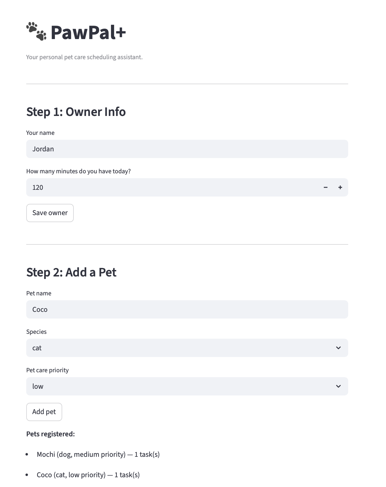
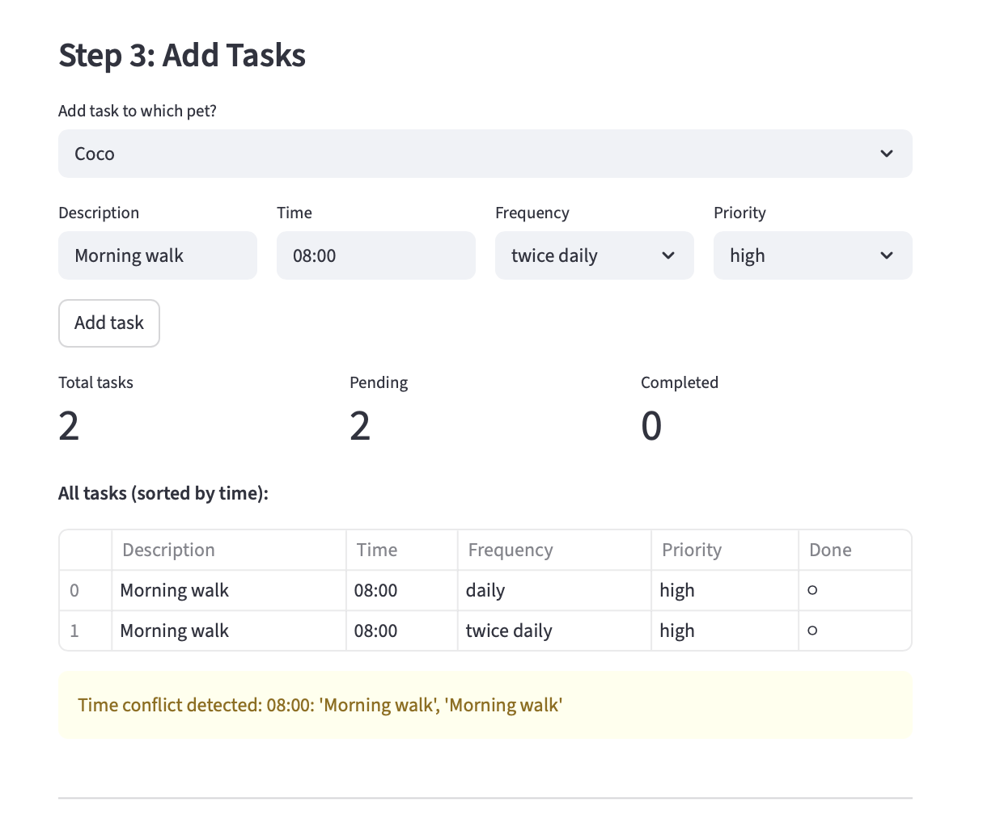
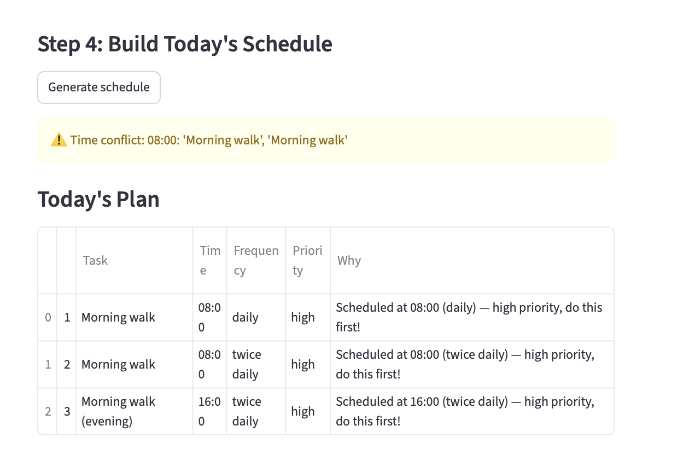
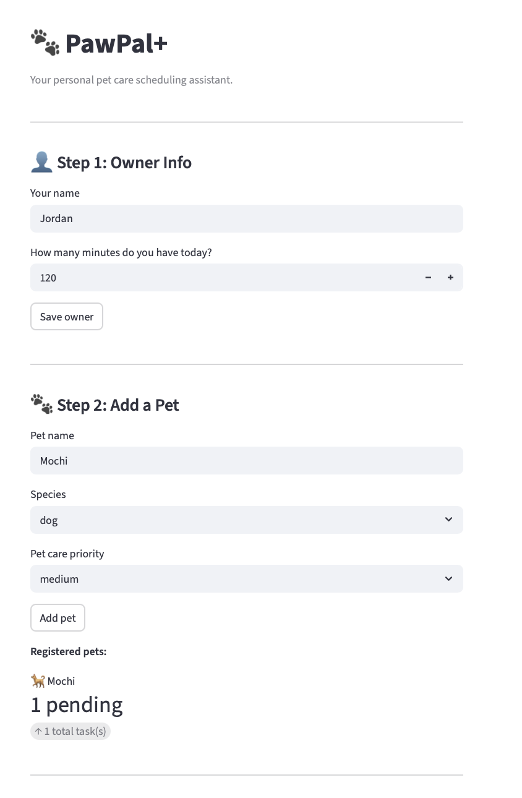
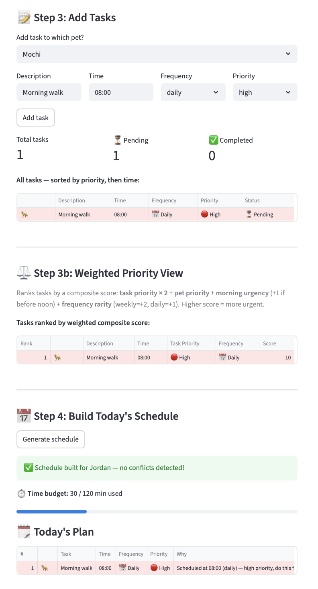

# PawPal+ (Module 2 Project)

You are building **PawPal+**, a Streamlit app that helps a pet owner plan care tasks for their pet.

## 📸 Demo

**App home — owner & pet setup**


**Adding tasks**


**Generated schedule**


**Extra task view 1**


**Extra task view 2**


## Scenario

A busy pet owner needs help staying consistent with pet care. They want an assistant that can:

- Track pet care tasks (walks, feeding, meds, enrichment, grooming, etc.)
- Consider constraints (time available, priority, owner preferences)
- Produce a daily plan and explain why it chose that plan

Your job is to design the system first (UML), then implement the logic in Python, then connect it to the Streamlit UI.

## What you will build

Your final app should:

- Let a user enter basic owner + pet info
- Let a user add/edit tasks (duration + priority at minimum)
- Generate a daily schedule/plan based on constraints and priorities
- Display the plan clearly (and ideally explain the reasoning)
- Include tests for the most important scheduling behaviors

## Smarter Scheduling

The scheduler goes beyond a simple priority sort. Five logic improvements make it more useful for real pet owners:

| Feature | How it works |
|---|---|
| **Sort by time** | Tasks are ordered chronologically by their `HH:MM` start time, then by priority within the same slot — so the day reads like a real timeline. |
| **Filter by pet / status** | `filter_by_pet("Mochi")` returns only Mochi's tasks. `filter_by_status(completed=False)` returns every unfinished task across all pets. |
| **Recurring task expansion** | A `"twice daily"` task automatically generates a second occurrence 8 hours later (e.g. breakfast at 08:30 → evening meal at 16:30), so both instances appear in the daily plan. |
| **Conflict detection** | Before building the schedule, the Scheduler scans for tasks pinned to the same start time and surfaces a clear warning — no silent overwrites, no crashes. |
| **Weighted prioritization** | `rank_by_weight()` ranks tasks by a composite score combining four factors: task priority (×2), pet priority, morning-time urgency (+1 before noon), and frequency rarity (weekly=+2 because they can't simply roll to tomorrow). See details below. |

### Weighted Prioritization — How It Works

`Scheduler.weighted_score(task)` computes:

```
score = (task_priority_weight × 2)
      + pet_priority_weight
      + morning_urgency          # +1 if task.time < 12:00
      + frequency_rarity         # weekly=2, daily=1, twice-daily=0
```

Where `high=3, medium=2, low=1` for both priority weights.

`rank_by_weight(tasks)` sorts the full list by descending score (ties broken by task priority), giving the owner a single ranked list of "what matters most right now" — independent of clock time. This is useful when the owner has a gap in their day and wants to know which task to tackle next, not just which one comes first on the timeline.

**Why this is harder than it looks:** Simple priority sorting ignores the pet's urgency level and treats a weekly grooming appointment the same as a daily walk. The weighted scorer balances all four dimensions simultaneously, so a high-priority weekly task for a high-priority pet that happens to be in the morning will always float to the top — even if a low-priority daily task is scheduled earlier on the clock.

---

## Agent Mode: How It Was Used to Implement Weighted Prioritization

Agent Mode in Claude Code was the primary tool for designing and implementing the `weighted_score` / `rank_by_weight` capability. Here is the exact workflow:

### 1. Design via multi-turn reasoning

Rather than jumping straight to code, I asked Claude (in Agent Mode with the full codebase loaded) to reason about what a "good" composite score would look like given the existing `PRIORITY_ORDER`, `TASK_DURATIONS`, and `Pet.priority` fields. The key prompt was:

> *"Given that `Scheduler` already has `sort_tasks` (chronological) and `sort_by_priority` (single dimension), design a third algorithm that is meaningfully different. It must be explainable to a non-technical pet owner and must use information already present in the data model."*

Claude read `pawpal_system.py` autonomously, identified the four exploitable dimensions (task priority, pet priority, time of day, frequency), and drafted the scoring formula before writing a single line of code.

### 2. Constraint enforcement

I set one hard design constraint before any code was written:

> *"The Scheduler is the only class that touches scoring and ranking. Pet and Owner stay passive data holders."*

Agent Mode respected this boundary: `weighted_score` lives entirely on `Scheduler`, iterating over `self.owner.pets` to look up pet priority rather than adding a method to `Pet`.

### 3. Code generation + immediate review

Once the formula was agreed on, I asked Claude to write the two methods with full docstrings. Agent Mode generated the code, and I reviewed the scoring logic directly against the formula before accepting the edit. One adjustment was made: the initial draft weighted `task_priority × 1`, but after discussing it I bumped the multiplier to `× 2` because task urgency should dominate pet-level urgency (a high-priority task for a medium-priority pet still needs to happen today).

### 4. UI wiring

I then asked Agent Mode to add a "Weighted Priority View" section to `app.py` that calls `rank_by_weight()` and displays the score column so users can see exactly why each task is ranked where it is. The prompt was:

> *"Add a new Streamlit section between Step 3 and Step 4 that shows the weighted ranking table. Include the numeric score so the user can see the algorithm's reasoning."*

Agent Mode found the correct insertion point in `app.py` without being told the line number, because it had already read the file.

### 5. What Agent Mode cannot replace

Agent Mode did not decide *which* four factors to include — that was an architectural judgment call made by reviewing what data the model actually had. It also did not decide the multiplier (`× 2` for task priority) — that required understanding the product intent. Agent Mode is a fast, precise executor. The architect still has to own the decisions.

---

## Testing PawPal+

### Run the test suite

```bash
python -m pytest
```

### What the tests cover

| Test | Description |
|---|---|
| `test_mark_complete_changes_status` | Verifies that calling `mark_complete()` on a Task sets `completed` to `True`. |
| `test_add_task_increases_pet_task_count` | Confirms that adding a Task to a Pet increases its task list by 1. |
| `test_sort_tasks_returns_chronological_order` | Checks that `Scheduler.sort_tasks()` returns tasks ordered earliest-to-latest by their `HH:MM` start time. |
| `test_expand_recurring_twice_daily_creates_two_entries` | Ensures a `"twice daily"` task expands into two entries, with the evening copy scheduled 8 hours after the original. |
| `test_detect_conflicts_flags_duplicate_times` | Verifies that `Scheduler.detect_conflicts()` catches and reports tasks pinned to the exact same time slot. |

### Confidence Level

**4 / 5 stars**

The core scheduling behaviors — task completion, pet task management, chronological sorting, recurring task expansion, and conflict detection — are all covered and passing. One star held back because edge cases such as non-clock time strings, tasks that exceed available time, and multi-pet conflict scenarios are not yet tested.

---

## Collaborating with AI: Reflections on Building PawPal+

### Which Claude features were most effective?

**Inline code generation (Edit mode)** was the single highest-leverage feature. Rather than copy-pasting snippets, Claude applied changes directly to the file with surgical precision — I could review a diff, accept or reject it, and move on. This kept the feedback loop tight and made it easy to stay in "architect mode" rather than getting lost in boilerplate.

**Ask mode / Explain** was essential during the UML-to-code translation phase. When I wasn't sure whether a method belonged on `Scheduler` or `Pet`, I could ask Claude to reason about the tradeoff before writing a single line. The answers were grounded in the actual class structure — not generic advice — because Claude had already read the file.

**Test generation** accelerated coverage. Describing the behavior I wanted to test in plain English ("verify that a twice-daily task expands into two entries, 8 hours apart") produced a test that matched the implementation exactly, including the correct assertion on `expanded[1].time == "16:30"`.

---

### One AI suggestion I rejected — and why

When generating the conflict-detection logic, Claude initially suggested a time-overlap check: compare each pair of tasks by computing their start and end times (using `TASK_DURATIONS`) and flag any pair whose intervals intersect.

I rejected it. The overlap approach required every task to have a well-defined duration, but the system already handles non-clock time strings like `"after meals"` — those tasks have no meaningful end time. The added complexity would have introduced edge cases without meaningfully improving the planner for its intended scale (one owner, short daily tasks).

Instead I kept the simpler exact-match check (`detect_conflicts` flags tasks sharing the identical `HH:MM` string) and documented the tradeoff in a comment. The rule: **don't add complexity the system doesn't earn yet.**

---

### How separate chat sessions helped

Each phase — UML design, class implementation, test writing, UI polish — started in its own conversation. This had two concrete benefits:

1. **Clean context.** Claude's suggestions stayed relevant to the phase at hand. A UI session wasn't polluted by half-finished class stubs from the implementation phase; a testing session wasn't second-guessing design decisions that were already locked in.
2. **Forced checkpoints.** Starting a new session meant summarizing what was done and what came next. That five-minute summary was often when I caught inconsistencies — a method name that drifted between the UML and the code, a test that assumed behavior the implementation didn't guarantee.

The sessions acted like git commits for intent: each one began with a clear scope and ended with something that worked.

---

### Lessons on being the "lead architect" with AI

The biggest lesson: **AI is a fast executor, not a decision-maker.** Claude can generate a `Scheduler` class in seconds, but it cannot know that your `Scheduler` should own conflict detection rather than `Schedule`, or that `filter_by_status` belongs on `Scheduler` rather than `Owner`, unless you tell it — and you can only tell it if you've already decided.

The moments where the collaboration broke down were always moments where I hadn't made a decision yet and was hoping Claude would make it for me. It would produce something plausible, I'd accept it, and two steps later the design would feel off. The fix was always the same: stop, decide, then ask.

The practical habit that helped most was writing a one-sentence design constraint before each prompt — something like *"the Scheduler is the only class that touches sorting and filtering; Pet and Owner stay passive data holders."* That constraint acted as a guardrail. Claude respected it precisely, and the resulting code stayed clean.

AI tools make you faster. But speed only compounds good decisions. The architect still has to show up.

---

## Getting started

### Setup

```bash
python -m venv .venv
source .venv/bin/activate  # Windows: .venv\Scripts\activate
pip install -r requirements.txt
```

### Suggested workflow

1. Read the scenario carefully and identify requirements and edge cases.
2. Draft a UML diagram (classes, attributes, methods, relationships).
3. Convert UML into Python class stubs (no logic yet).
4. Implement scheduling logic in small increments.
5. Add tests to verify key behaviors.
6. Connect your logic to the Streamlit UI in `app.py`.
7. Refine UML so it matches what you actually built.
